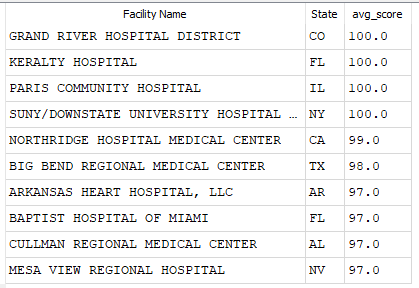
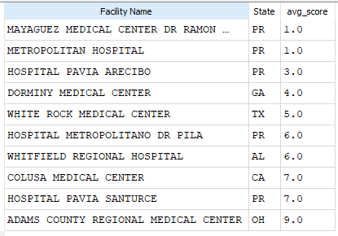
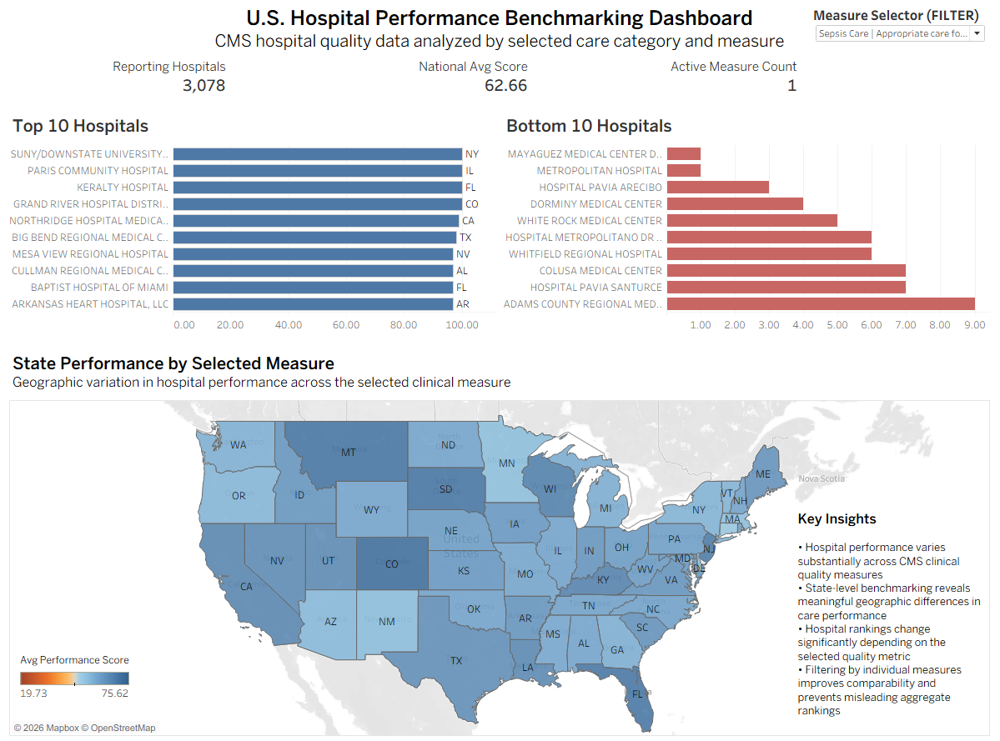

# U.S. Hospital Performance Benchmarking Dashboard

## Project Overview

This project analyzes CMS hospital quality performance data using SQL and Tableau Public to benchmark hospital performance across multiple clinical quality measures.

The dashboard enables interactive exploration of hospital performance by selected CMS care measure, helping identify:

- Top-performing hospitals
- Low-performing hospitals
- Geographic performance variation
- Measure-specific benchmarking trends

This project demonstrates:

- SQL data cleaning
- Public healthcare dataset transformation
- KPI development
- Interactive dashboard design
- Geographic healthcare analysis
- Analytical decision-making around metric comparability

---

# Business Problem

CMS hospital quality datasets contain multiple healthcare performance measures across different clinical categories. However, not all measures are directly comparable.

Some measures represent:

- Clinical care quality percentages
- Operational timing metrics
- Emergency Department throughput measures

Averaging incompatible metrics together produced misleading hospital rankings and distorted benchmarking results.

The goal of this project was to:

1. Clean and standardize the dataset
2. Remove incompatible performance measures
3. Create meaningful hospital benchmarking views
4. Build an interactive healthcare analytics dashboard

---

# Dataset

Source:

[CMS Timely and Effective Care – Hospital Quality Data](https://data.cms.gov/provider-data/dataset/yv7e-xc69#data-table)

Dataset includes:

- Hospital identifiers
- State locations
- Clinical care measures
- CMS quality scores
- Hospital performance metrics

Final Tableau dataset:

```text
healthcare_final_v2.csv
```

---

# SQL Data Cleaning Process

The dataset required significant cleaning before analysis.

Cleaning steps included:

- Removing null and blank values
- Removing "Not Available" scores
- Removing invalid zero-score records
- Standardizing score formatting
- Excluding incompatible Emergency Department timing and volume metrics

## Key Analytical Decision

Emergency Department timing and throughput measures were excluded because they used different scales and distorted clinical quality benchmarking comparisons.

---

# SQL Pipeline

## 1. Create Clean Base Table

```sql
DROP TABLE IF EXISTS healthcare_clean;

CREATE TABLE healthcare_clean AS
SELECT
    "Facility ID",
    "Facility Name",
    State,
    Condition,
    "Measure ID",
    "Measure Name",
    CAST(Score AS FLOAT) AS Score
FROM healthcare_dataset
WHERE Score IS NOT NULL
AND Score != ''
AND Score != 'Not Available'
AND State IS NOT NULL
AND State != ''
AND "Facility ID" IS NOT NULL
AND "Facility ID" != ''
AND "Facility Name" IS NOT NULL
AND "Facility Name" != ''
AND CAST(Score AS FLOAT) > 0;
```

---

## 2. Remove Incompatible Emergency Department Metrics

```sql
DROP TABLE IF EXISTS healthcare_final;

CREATE TABLE healthcare_final AS
SELECT *
FROM healthcare_clean
WHERE "Measure Name" NOT LIKE '%Emergency Department%'
AND "Measure Name" NOT LIKE '%median time%'
AND "Measure Name" NOT LIKE '%department volume%';
```

---

## 3. Final Tableau Export Table

```sql
DROP TABLE IF EXISTS healthcare_final_v2;

CREATE TABLE healthcare_final_v2 AS
SELECT *
FROM healthcare_final
WHERE Score > 0;
```

---

# SQL Validation Queries

## Total Reporting Hospitals

```sql
SELECT COUNT(DISTINCT "Facility ID") AS reporting_hospitals
FROM healthcare_final_v2;
```


---

## National Average Score

```sql
SELECT ROUND(AVG(Score), 2) AS national_avg_score
FROM healthcare_final_v2;
```

---

## Active Measure Count

```sql
SELECT COUNT(DISTINCT "Measure Name") AS active_measure_count
FROM healthcare_final_v2;
```

---

## Available Measures and Hospital Counts

```sql
SELECT
    Condition,
    "Measure Name",
    COUNT(DISTINCT "Facility ID") AS hospital_count,
    ROUND(AVG(Score), 2) AS avg_score
FROM healthcare_final_v2
GROUP BY Condition, "Measure Name"
ORDER BY hospital_count DESC;
```

---

## Top 10 Hospitals by Selected Measure

```sql
SELECT
    "Facility Name",
    State,
    ROUND(AVG(Score), 2) AS avg_score
FROM healthcare_final_v2
WHERE "Measure Name" = 'Appropriate care for severe sepsis and septic shock'
GROUP BY "Facility Name", State
ORDER BY avg_score DESC
LIMIT 10;
```



---

## Bottom 10 Hospitals by Selected Measure

```sql
SELECT
    "Facility Name",
    State,
    ROUND(AVG(Score), 2) AS avg_score
FROM healthcare_final_v2
WHERE "Measure Name" = 'Appropriate care for severe sepsis and septic shock'
GROUP BY "Facility Name", State
ORDER BY avg_score ASC
LIMIT 10;
```



---

## State Map Verification Query

```sql
SELECT
    State,
    COUNT(DISTINCT "Facility ID") AS hospitals_reporting,
    ROUND(AVG(Score), 2) AS avg_score
FROM healthcare_final_v2
WHERE "Measure Name" = 'Appropriate care for severe sepsis and septic shock'
GROUP BY State
ORDER BY avg_score DESC;
```

---

# Tableau Dashboard Features

The interactive Tableau dashboard includes:

- KPI cards
- Top 10 hospital rankings
- Bottom 10 hospital rankings
- Interactive measure selector
- U.S. state performance map
- Geographic benchmarking analysis
- Dynamic filtering by clinical measure

Dashboard title:

```text
U.S. Hospital Performance Benchmarking Dashboard
```

---

# Dashboard Screenshot

## Full Dashboard



---

# Key Insights

- Hospital performance varies substantially across CMS clinical quality measures
- State-level benchmarking reveals meaningful geographic differences in care performance
- Hospital rankings change significantly depending on the selected quality metric
- Filtering by individual measures improves comparability and prevents misleading aggregate rankings

---

# Tools Used

- SQLite
- DB Browser for SQLite
- Tableau Public
- SQL
- Public CMS Healthcare Data

---

# Analytical Approach

This project focused on building meaningful healthcare performance comparisons rather than simply visualizing raw data.

The primary analytical challenge involved identifying incompatible metrics that distorted aggregate benchmarking.

By removing operational timing and throughput measures from the final dataset, the dashboard produces more accurate hospital performance comparisons across comparable clinical quality measures.

This project demonstrates:

- Data cleaning
- Data validation
- Metric comparability analysis
- KPI development
- Dashboard design
- Geographic analytics
- Healthcare benchmarking

---

# Tableau Public Dashboard

Add your Tableau Public link here after publishing:

```text
[Insert Tableau Public Link]
```

---

# Repository Structure

```text
project-folder/
│
├── data/
│   └── healthcare_final_v2.csv
│
├── images/
│   ├── dashboard_overview.png
│   ├── sql_cleaning_query.png
│   ├── top_10_query_results.png
│   └── bottom_10_query_results.png
│
├── SQL/
│   └── healthcare_analysis.sql
│
└── README.md
```

---
